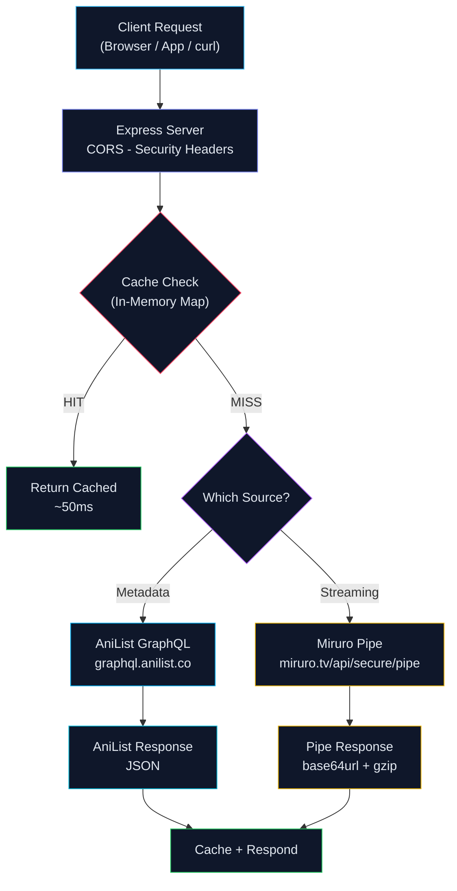

<div align="center">
  
  

</div>

<p align="center">
  <a href="https://github.com/Shineii86/MiruroAPI/stargazers"></a>
  <a href="https://github.com/Shineii86/MiruroAPI/network/members"></a>
  <a href="https://github.com/Shineii86/MiruroAPI/issues"></a>
  <a href="https://github.com/Shineii86/MiruroAPI/pulls"></a>
  <a href="https://github.com/Shineii86/MiruroAPI/commits"></a>
  <a href="https://github.com/Shineii86/MiruroAPI/blob/main/LICENSE"></a>
</p>

<p align="center">
  
  
  
  
  
  
  
  
</p>

<p align="center">
  <b>Free RESTful API for anime streaming data powered by AniList GraphQL and Miruro providers.</b><br/>
  Search, browse, filter, watch — every endpoint returns fresh data with smart caching.<br/>
  18 endpoints, 12 streaming providers, M3U8 URLs with subtitles and skip timestamps.
</p>

<p align="center">
  <a href="#-table-of-contents">Table of Contents</a> &bull;
  <a href="#-features">Features</a> &bull;
  <a href="#-api-endpoints">API Docs</a> &bull;
  <a href="#-quick-start">Quick Start</a> &bull;
  <a href="#-deployment">Deployment</a> &bull;
  <a href="#-contributing">Contributing</a>
</p>

---

> ## Disclaimer
>
> 1. This `API` does not store any files — it only links to media hosted on 3rd party services.
> 2. This `API` is explicitly made for **educational purposes only** and not for commercial usage. This repo will not be responsible for any misuse of it.
> 3. All anime data, images, and content belong to their respective owners (AniList, Miruro). This project is not affiliated with miruro.tv.

---

## Table of Contents

- [Overview](#-overview)
- [Features](#-features)
- [Data Sources](#-data-sources)
- [Tech Stack](#-tech-stack)
- [Architecture](#-architecture)
- [Project Structure](#-project-structure)
- [Quick Start](#-quick-start)
- [Configuration](#-configuration)
- [API Endpoints](#-api-endpoints)
- [Streaming Flow](#-streaming-flow)
- [Response Schema](#-response-schema)
- [Deployment](#-deployment)
- [Performance](#-performance)
- [FAQ](#-faq)
- [Contributing](#-contributing)
- [License](#-license)
- [Author](#-author)

---

## Overview

**MiruroAPI** is a serverless anime data API that fetches real-time information from **AniList GraphQL** and streaming data from **Miruro providers** — including anime details, episode lists, M3U8 streaming URLs with subtitles and skip timestamps, search, filtering, characters, and more — all through a clean REST API with zero database.

> No database, no auth, no complex setup. Just deploy to Vercel and you have a production API.

### Why MiruroAPI?

- **18 Endpoints** — Complete anime data coverage
- **AniList GraphQL** — Rich metadata: scores, characters, relations, recommendations
- **12 Streaming Providers** — kiwi, pewe, bee, bonk, bun, ally, nun, twin, cog, moo, hop, telli
- **M3U8 URLs** — Direct streaming links with resolution, codec, fansub info
- **Skip Timestamps** — OP/ED skip data for supported anime
- **Smart Caching** — In-memory Map with TTL reduces API load
- **CORS Enabled** — Works from any frontend, no proxy needed
- **Swagger UI** — Interactive API documentation at `/docs`
- **Docker Ready** — One-command containerized deployment

### How It Works



---

## Features

<table>
  <tr>
    <td>

### Core
- **AniList GraphQL** for rich metadata
- **Miruro pipe** for streaming sources
- **Smart caching** with configurable TTL
- **18 RESTful endpoints**
- **Graceful error handling** per endpoint
- **Rate limiting** (100 req/min per IP)

    </td>
    <td>

### Data
- **Full-text search** with pagination
- **Autocomplete suggestions** for search
- **Advanced filtering** — genre, year, season, format, sort
- **Characters** with voice actors
- **Relations** and **Recommendations**
- **Airing schedule** by date

    </td>
  </tr>
  <tr>
    <td>

### Streaming
- **Episode lists** from 12 providers
- **M3U8 streaming URLs** with resolution info
- **Skip timestamps** (OP/ED)
- **Download links** when available
- **Sub/Dub** support per provider
- **Codec and fansub** metadata

    </td>
    <td>

### Reliability
- **CORS enabled** — works from any frontend
- **Error responses** with descriptive messages
- **Input validation** — required params checked
- **Timeout protection** — per request
- **In-memory caching** — survives warm starts
- **Zero database** — pure API + cache

    </td>
  </tr>
</table>

### Feature Highlights

| Feature | Description | Status |
|:---|:---|:---:|
| 18 API Endpoints | Complete anime data coverage | Done |
| AniList GraphQL | Rich metadata from AniList | Done |
| 12 Streaming Providers | M3U8 streaming sources | Done |
| Full-Text Search | Keyword search with pagination | Done |
| Autocomplete Suggestions | Fast search suggestions | Done |
| Advanced Filtering | Genre, year, season, format, sort | Done |
| Characters + Voice Actors | Full character data from AniList | Done |
| Relations & Recommendations | Related anime discovery | Done |
| Skip Timestamps | OP/ED skip data | Done |
| Smart Caching | In-memory Map with TTL | Done |
| Swagger UI Docs | Interactive API documentation | Done |
| Docker Support | Containerized deployment | Done |

---

## Data Sources

### Metadata Source

| Source | API | Data |
|:---|:---|:---|
| **AniList** | `graphql.anilist.co` | Search, info, characters, relations, recommendations, filter, schedule |

### Streaming Source

| Source | Domain | Data |
|:---|:---|:---|
| **Miruro** | `miruro.tv` | Episodes, streaming sources (M3U8 URLs) |
| **Miruro** | `miruro.to` | Mirror domain |
| **Miruro** | `miruro.bz` | Mirror domain |
| **Miruro** | `miruro.ru` | Mirror domain |

### Streaming Providers

| Provider | Provider | Provider | Provider |
|:---|:---|:---|:---|
| kiwi | pewe | bee | bonk |
| bun | ally | nun | twin |
| cog | moo | hop | telli |

---

## Tech Stack

| Technology | Purpose | Version |
|:---|:---|:---|
| [Node.js](https://nodejs.org/) | JavaScript runtime | >= 20 |
| [Express](https://expressjs.com/) | HTTP server framework | 4.21 |
| [AniList GraphQL](https://anilist.gitbook.io/anilist-apiv2-docs/) | Anime metadata API | — |
| [Axios](https://axios-http.com/) | HTTP client | 1.8 |
| [Vercel Functions](https://vercel.com/docs/functions) | Serverless deployment | — |
| [cors](https://github.com/expressjs/cors) | CORS middleware | 2.8 |
| [dotenv](https://github.com/motdotla/dotenv) | Environment variables | 16.4 |

### Dependencies

```json
{
  "express": "^4.21.0",
  "axios": "^1.8.0",
  "cors": "^2.8.5",
  "dotenv": "^16.4.0"
}
```

---

## Architecture

### Request Flow

| Stage | Component | Description |
|:---:|-----------|-------------|
| 1 | **Client** | Browser, app, or `curl` sends request |
| 2 | **Express Server** | Routes request, applies CORS + security headers + rate limiting |
| 3 | **Cache Check** | In-memory Map with TTL — hit = instant response |
| 4 | **Fetch Data** | AniList GraphQL or Miruro pipe endpoint |
| 5 | **Decode** | Pipe responses decoded: base64url -> gunzip -> JSON |
| 6 | **Cache + Respond** | Store in cache, return JSON response |

### Caching Architecture

| Cache Type | TTL | Max Size | Eviction |
|:---|:---|:---|:---|
| Search results | 1 min | 100 entries | FIFO |
| Collection lists | 2-5 min | 100 entries | FIFO |
| Episode lists | 2 min | 100 entries | FIFO |
| Streaming sources | 1 min | 100 entries | FIFO |

> Serverless functions have read-only filesystems except `/tmp`. The cache uses in-memory `Map` which survives across warm invocations.

---

## Project Structure

```
MiruroAPI/
├── public/                              # Static files
│   ├── index.html                       #   Premium landing page
│   ├── docs.html                        #   Swagger UI documentation
│   ├── openapi.json                     #   OpenAPI 3.0 spec
│   ├── icon-dark.svg                    #   Miruro dark mode favicon
│   ├── icon-light.svg                   #   Miruro light mode favicon
│   ├── icon-512x512.png                 #   Miruro app icon
│   ├── favicon.ico                      #   Classic favicon
│   ├── apple-touch-icon-180x180.png     #   iOS home screen icon
│   └── og-image.png                     #   OG/Twitter share image
│
├── assets/                              # Scraped Miruro assets
│   ├── favicons/                        #   All favicon variants
│   ├── logos/                           #   Status page logo
│   ├── fonts/                           #   Inter + FontAwesome
│   └── media/                           #   Testimonial avatars
│
├── src/
│   ├── helpers/
│   │   ├── anilist.js                   # AniList GraphQL integration
│   │   ├── pipe.js                      # Miruro pipe integration
│   │   └── cache.js                     # In-memory cache with TTL
│   └── routes/
│       └── apiRoutes.js                 # All 18 route definitions
│
├── server.js                            # Express server entry point
├── package.json                         # Dependencies & scripts
├── vercel.json                          # Vercel routing config
├── Dockerfile                           # Docker support
├── CHANGELOG.md                         # Version history
└── README.md                            # This file
```

---

## Quick Start

### Prerequisites

| Requirement | Minimum | Recommended |
|:---|:---|:---|
| Node.js | 20.x | 20.x LTS |
| npm | 9.0+ | 10.x |

### Installation

```bash
# 1. Clone the repository
git clone https://github.com/Shineii86/MiruroAPI.git
cd MiruroAPI

# 2. Install dependencies
npm install

# 3. Start development server
npm run dev
```

> Open [http://localhost:3000](http://localhost:3000) in your browser.

### Production

```bash
npm start
```

### Alternative Package Managers

```bash
# yarn
yarn install && yarn dev

# pnpm
pnpm install && pnpm dev

# bun
bun install && bun dev
```

---

## Configuration

### Environment Variables

| Variable | Default | Description |
|:---|:---|:---|
| `PORT` | `3000` | Server port |
| `ALLOWED_ORIGINS` | `*` | Comma-separated allowed origins |

### Vercel Configuration

The `vercel.json` handles:
- **Builds** — Maps `server.js` to `@vercel/node`
- **Routes** — All requests forwarded to Express

---

## API Endpoints

### Base URL

```
https://mirurotvapi.vercel.app/api
```

### Response Format

All endpoints return:

```json
{
  "success": true,
  "results": { ... }
}
```

---

### Health Check

```bash
GET /api/health
```

```bash
curl "https://mirurotvapi.vercel.app/api/health"
```

<details>
<summary>Response</summary>

```json
{
  "success": true,
  "results": {
    "status": "healthy",
    "version": "1.2.0",
    "uptime": "0h 0m 34s",
    "uptimeSeconds": 34,
    "timestamp": "2026-06-09T09:55:00.884Z",
    "node": "v24.14.1",
    "memory": { "used": "13MB", "total": "15MB" },
    "endpoints": 16,
    "providers": ["kiwi","pewe","bee","bonk","bun","ally","nun","twin","cog","moo","hop","telli"]
  }
}
```
</details>

---

### Search

```bash
GET /api/search?query=naruto&per_page=2
```

| Param | Type | Default | Description |
|:---|:---|:---|:---|
| `query` | string | **required** | Search keyword |
| `page` | number | 1 | Page number |
| `per_page` | number | 20 | Results per page |

```bash
curl "https://mirurotvapi.vercel.app/api/search?query=naruto&per_page=2"
```

```javascript
const res = await fetch("https://mirurotvapi.vercel.app/api/search?query=naruto&per_page=2");
const data = await res.json();
console.log(data.results); // { page, perPage, total, hasNextPage, results: [...] }
```

<details>
<summary>Response</summary>

```json
{
  "success": true,
  "results": {
    "page": 1,
    "perPage": 2,
    "total": 5000,
    "hasNextPage": true,
    "results": [
      {
        "id": 20,
        "title": { "romaji": "NARUTO", "english": "Naruto", "native": "NARUTO -ナルト-" },
        "coverImage": { "large": "https://s4.anilist.co/file/anilistcdn/media/anime/cover/medium/bx20-dE6UHbFFg1A5.jpg" },
        "format": "TV",
        "season": "FALL",
        "seasonYear": 2002,
        "episodes": 220,
        "status": "FINISHED",
        "averageScore": 80,
        "genres": ["Action","Adventure","Comedy","Drama","Fantasy","Supernatural"]
      }
    ]
  }
}
```
</details>

---

### Suggestions

```bash
GET /api/suggestions?query=naruto
```

| Param | Type | Default | Description |
|:---|:---|:---|:---|
| `query` | string | **required** | Search keyword |

```bash
curl "https://mirurotvapi.vercel.app/api/suggestions?query=naruto"
```

<details>
<summary>Response</summary>

```json
{
  "success": true,
  "results": [
    { "id": 20, "title": "Naruto", "title_romaji": "NARUTO", "poster": "...", "format": "TV", "status": "FINISHED", "year": 2002, "episodes": 220 },
    { "id": 1735, "title": "Naruto: Shippuden", "title_romaji": "NARUTO: Shippuuden", "poster": "...", "format": "TV", "status": "FINISHED", "year": 2007, "episodes": 500 }
  ]
}
```
</details>

---

### Filter

```bash
GET /api/filter?genre=Action&sort=POPULARITY_DESC&per_page=1
```

| Param | Type | Default | Description |
|:---|:---|:---|:---|
| `genre` | string | — | Genre name (e.g. "Action") |
| `tag` | string | — | Tag name |
| `year` | number | — | Release year |
| `season` | string | — | FALL, WINTER, SPRING, SUMMER |
| `format` | string | — | TV, MOVIE, OVA, ONA, SPECIAL, MUSIC |
| `status` | string | — | RELEASING, FINISHED, NOT_YET_RELEASED, CANCELLED |
| `sort` | string | POPULARITY_DESC | Sort order |
| `page` | number | 1 | Page number |
| `per_page` | number | 20 | Results per page |

```bash
curl "https://mirurotvapi.vercel.app/api/filter?genre=Action&year=2024&season=WINTER&per_page=3"
```

<details>
<summary>Response</summary>

```json
{
  "success": true,
  "results": {
    "page": 1,
    "perPage": 3,
    "total": 5000,
    "hasNextPage": true,
    "results": [ ... ]
  }
}
```
</details>

---

### Trending

```bash
GET /api/trending?per_page=10
```

| Param | Type | Default | Description |
|:---|:---|:---|:---|
| `per_page` | number | 20 | Results per page |

```bash
curl "https://mirurotvapi.vercel.app/api/trending?per_page=3"
```

---

### Popular

```bash
GET /api/popular?per_page=10
```

---

### Upcoming

```bash
GET /api/upcoming?per_page=10
```

---

### Recent

```bash
GET /api/recent?per_page=10
```

---

### Spotlight

```bash
GET /api/spotlight
```

Returns featured/spotlight anime for the hero carousel.

<details>
<summary>Response</summary>

```json
{
  "success": true,
  "results": [
    {
      "id": 21,
      "title": { "romaji": "ONE PIECE", "english": "One Piece" },
      "coverImage": { "large": "..." },
      "bannerImage": "https://...",
      "format": "TV",
      "episodes": null,
      "status": "RELEASING",
      "averageScore": 85,
      "genres": ["Action","Adventure","Comedy","Fantasy"],
      "description": "Gol D. Roger was known as the Pirate King..."
    }
  ]
}
```
</details>

---

### Schedule

```bash
GET /api/schedule?date=2026-06-09
```

| Param | Type | Default | Description |
|:---|:---|:---|:---|
| `date` | string | today | Date in YYYY-MM-DD format |

---

### Anime Info

```bash
GET /api/info/:id
```

| Param | Type | Default | Description |
|:---|:---|:---|:---|
| `id` | number | **required** | AniList anime ID |

```bash
curl "https://mirurotvapi.vercel.app/api/info/20"
```

```javascript
const res = await fetch("https://mirurotvapi.vercel.app/api/info/20");
const data = await res.json();
console.log(data.results.title); // { romaji: "NARUTO", english: "Naruto" }
```

<details>
<summary>Response</summary>

```json
{
  "success": true,
  "results": {
    "id": 20,
    "idMal": 20,
    "title": { "romaji": "NARUTO", "english": "Naruto", "native": "NARUTO -ナルト-" },
    "description": "Naruto Uzumaki, a hyperactive and knuckle-headed ninja...",
    "coverImage": { "large": "https://s4.anilist.co/file/..." },
    "bannerImage": "https://s4.anilist.co/file/...",
    "format": "TV",
    "season": "FALL",
    "seasonYear": 2002,
    "episodes": 220,
    "duration": 23,
    "status": "FINISHED",
    "averageScore": 80,
    "popularity": 694959,
    "genres": ["Action","Adventure","Comedy","Drama","Fantasy","Supernatural"],
    "studios": [{ "name": "Studio Pierrot", "isAnimationStudio": true }],
    "startDate": { "year": 2002, "month": 10, "day": 3 },
    "endDate": { "year": 2007, "month": 2, "day": 8 }
  }
}
```
</details>

---

### Characters

```bash
GET /api/anime/:id/characters
```

| Param | Type | Default | Description |
|:---|:---|:---|:---|
| `id` | number | **required** | AniList anime ID |

```bash
curl "https://mirurotvapi.vercel.app/api/anime/20/characters"
```

<details>
<summary>Response</summary>

```json
{
  "success": true,
  "results": {
    "edges": [
      {
        "role": "MAIN",
        "node": {
          "id": 17,
          "name": { "full": "Naruto Uzumaki", "native": "うずまきナルト" },
          "image": { "large": "https://s4.anilist.co/file/..." }
        },
        "voiceActors": [
          {
            "id": 95015,
            "name": { "full": "Junko Takeuchi", "native": "竹内順子" },
            "languageV2": "Japanese"
          }
        ]
      }
    ]
  }
}
```
</details>

---

### Relations

```bash
GET /api/anime/:id/relations
```

Returns related anime (sequels, prequels, side stories, etc.).

---

### Recommendations

```bash
GET /api/anime/:id/recommendations
```

Returns recommended anime based on the given ID.

---

### Episodes

```bash
GET /api/episodes/:id
```

| Param | Type | Default | Description |
|:---|:---|:---|:---|
| `id` | number | **required** | AniList anime ID |

```bash
curl "https://mirurotvapi.vercel.app/api/episodes/20"
```

<details>
<summary>Response</summary>

```json
{
  "success": true,
  "results": {
    "providers": {
      "kiwi": {
        "meta": { "id": "1571", "title": "Naruto", "type": "TV" },
        "episodes": {
          "sub": [
            {
              "id": "watch/kiwi/20/sub/anikoto-1",
              "number": 1,
              "title": "Enter: Naruto Uzumaki!",
              "image": "https://image.tmdb.org/t/p/original/...",
              "airDate": "2002-10-03",
              "audio": "sub",
              "filler": false,
              "fillerType": "manga_canon"
            }
          ]
        }
      }
    }
  }
}
```
</details>

---

### Watch (Streaming Sources)

```bash
GET /api/watch/:provider/:anilistId/:category/:slug
```

| Param | Type | Default | Description |
|:---|:---|:---|:---|
| `provider` | string | **required** | Provider name (kiwi, pewe, etc.) |
| `anilistId` | number | **required** | AniList anime ID |
| `category` | string | **required** | sub or dub |
| `slug` | string | **required** | Episode slug from episodes response |

```bash
curl "https://mirurotvapi.vercel.app/api/watch/kiwi/20/sub/animepahe-1"
```

```javascript
const res = await fetch("https://mirurotvapi.vercel.app/api/watch/kiwi/20/sub/animepahe-1");
const data = await res.json();
const streams = data.results.streams;
// streams[0].url = "https://vault-01.uwucdn.top/stream/.../uwu.m3u8"
// streams[0].quality = "360p"
// streams[0].type = "hls"
```

<details>
<summary>Response</summary>

```json
{
  "success": true,
  "results": {
    "streams": [
      {
        "url": "https://vault-01.uwucdn.top/stream/.../uwu.m3u8",
        "type": "hls",
        "quality": "360p",
        "resolution": { "width": 640, "height": 360 },
        "codec": "h264",
        "audio": "sub",
        "fansub": "df68",
        "isActive": false,
        "referer": "https://kwik.cx/e/..."
      },
      {
        "url": "https://kwik.cx/e/...",
        "type": "embed",
        "quality": "360p",
        "codec": "h264",
        "audio": "sub",
        "fansub": "df68",
        "isActive": false
      }
    ],
    "download": "https://pahe.win/LJmbA"
  }
}
```
</details>

---

## Streaming Flow

To get a stream URL, follow these 3 steps:

```bash
# Step 1: Get episodes (returns provider slugs)
curl "https://mirurotvapi.vercel.app/api/episodes/20"
# => providers.kiwi.episodes.sub[0].id = "watch/kiwi/20/sub/anikoto-1"

# Step 2: Get streaming sources
curl "https://mirurotvapi.vercel.app/api/watch/kiwi/20/sub/animepahe-1"
# => streams[0].url = "https://...m3u8"

# Step 3: Play M3U8 in any HLS player
# Use hls.js, video.js, or native <video> with hls support
```

### Sub & Dub

Providers return both `sub` and `dub` episode lists:

```javascript
const eps = await fetch("/api/episodes/20").then(r => r.json());
const providers = eps.results.providers;

// Pick provider
const kiwi = providers.kiwi.episodes;

// Get sub episodes
const subEps = kiwi.sub; // [{ id: "watch/kiwi/20/sub/anikoto-1", ... }]

// Get dub episodes (if available)
const dubEps = kiwi.dub || []; // [{ id: "watch/kiwi/20/dub/...", ... }]
```

### HLS Player Example

```html
<script src="https://cdn.jsdelivr.net/npm/hls.js@latest"></script>
<video id="player" controls></video>
<script>
  const video = document.getElementById('player');
  const streamUrl = 'https://...m3u8'; // From /api/watch response
  
  if (Hls.isSupported()) {
    const hls = new Hls();
    hls.loadSource(streamUrl);
    hls.attachMedia(video);
  } else if (video.canPlayType('application/vnd.apple.mpegurl')) {
    video.src = streamUrl; // Native HLS (Safari)
  }
</script>
```

---

## Response Schema

### Standard Response

```typescript
interface ApiResponse<T> {
  success: boolean;
  results: T;
}
```

### Search Response

```typescript
interface SearchResults {
  page: number;
  perPage: number;
  total: number;
  hasNextPage: boolean;
  results: Anime[];  // AniList anime objects
}
```

### Episodes Response

```typescript
interface EpisodesResults {
  providers: {
    [provider: string]: {
      meta: { id: string; title: string; type: string };
      episodes: {
        sub: Episode[];
        dub?: Episode[];
      };
    };
  };
}

interface Episode {
  id: string;       // e.g. "watch/kiwi/20/sub/anikoto-1"
  number: number;
  title: string;
  image: string;
  airDate: string;
  audio: "sub" | "dub";
  filler: boolean;
  fillerType: string;
}
```

### Watch Response

```typescript
interface WatchResults {
  streams: Stream[];
  download?: string;
}

interface Stream {
  url: string;          // M3U8 URL or embed URL
  type: "hls" | "embed";
  quality: string;      // e.g. "360p", "720p", "1080p"
  resolution?: { width: number; height: number };
  codec: string;        // e.g. "h264"
  audio: "sub" | "dub";
  fansub: string;
  isActive: boolean;
  referer?: string;
}
```

---

## Deployment

### Vercel (Recommended)

[](https://vercel.com/new/clone?repository-url=https://github.com/Shineii86/MiruroAPI)

```bash
# Or manually
npm i -g vercel
vercel
```

### Docker

```bash
# Build
docker build -t miruroapi .

# Run
docker run -p 3000:3000 miruroapi
```

### Standalone

```bash
git clone https://github.com/Shineii86/MiruroAPI.git
cd MiruroAPI
npm install
npm start
```

---

## Performance

| Metric | Value |
|:---|:---|
| Cold start | ~500ms |
| Warm response | ~50-200ms |
| Cache hit | ~10ms |
| Memory usage | ~15MB |
| Cache TTL | 1-5 min |
| Max cache size | 100 entries |
| Rate limit | 100 req/min/IP |

---

## FAQ

### What data does MiruroAPI provide?

Anime metadata from AniList (titles, descriptions, scores, characters, relations) and streaming sources from Miruro providers (M3U8 URLs, quality, codec, fansub info).

### Does this API store any files?

No. MiruroAPI is a proxy/aggregator that fetches data from AniList GraphQL and Miruro pipe endpoints. No files are stored on the server.

### Is there rate limiting?

Yes, 100 requests per minute per IP address. Exceeding this returns a 429 status.

### Which streaming providers are supported?

12 providers: kiwi, pewe, bee, bonk, bun, ally, nun, twin, cog, moo, hop, telli.

### Can I use this in production?

This API is for educational purposes. Use at your own discretion.

---

## Contributing

1. Fork the repository
2. Create a feature branch (`git checkout -b feature/amazing-feature`)
3. Commit changes (`git commit -m 'Add amazing feature'`)
4. Push to branch (`git push origin feature/amazing-feature`)
5. Open a Pull Request

---

## License

This project is licensed under the MIT License.

```
MIT License

Copyright (c) 2026 Shinei Nouzen

Permission is hereby granted, free of charge, to any person obtaining a copy
of this software and associated documentation files (the "Software"), to deal
in the Software without restriction, including without limitation the rights
to use, copy, modify, merge, publish, distribute, sublicense, and/or sell
copies of the Software, and to permit persons to whom the Software is
furnished to do so, subject to the following conditions:

The above copyright notice and this permission notice shall be included in all
copies or substantial portions of the Software.

THE SOFTWARE IS PROVIDED "AS IS", WITHOUT WARRANTY OF ANY KIND, EXPRESS OR
IMPLIED, INCLUDING BUT NOT LIMITED TO THE WARRANTIES OF MERCHANTABILITY,
FITNESS FOR A PARTICULAR PURPOSE AND NONINFRINGEMENT. IN NO EVENT SHALL THE
AUTHORS OR COPYRIGHT HOLDERS BE LIABLE FOR ANY CLAIM, DAMAGES OR OTHER
LIABILITY, WHETHER IN AN ACTION OF CONTRACT, TORT OR OTHERWISE, ARISING FROM,
OUT OF OR IN CONNECTION WITH THE SOFTWARE OR THE USE OR OTHER DEALINGS IN THE
SOFTWARE.
```

---

## Author

**Shinei Nouzen**

- GitHub: [@Shineii86](https://github.com/Shineii86)
- MiruroAPI: [mirurotvapi.vercel.app](https://mirurotvapi.vercel.app)
